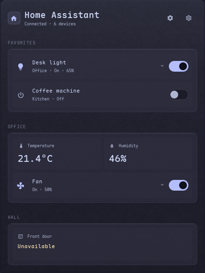
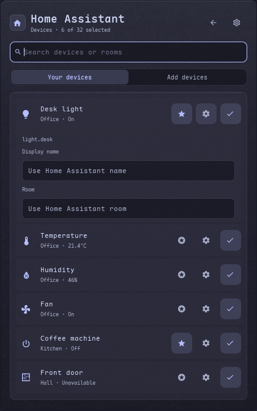

# Home Assistant

The house icon stays in the menu bar, including before setup. Open it to connect
with a server URL and a long-lived access token from your Home Assistant profile.
The connection is checked before saving. The system keyring may ask to unlock.
Tokens go through libsecret's `secret-tool`, using the standard
[Secret Service API](https://specifications.freedesktop.org/secret-service/).
KWallet and other compatible providers work without provider-specific code.
The token travels on the helper's stdin, never in command arguments or logs, and
the password field clears after submission and when the panel closes.

The home view leads with Favorites, then a card for each room. Every selected
sensor has a named readout; temperature and humidity no longer disappear into
room headings. Readouts can be favorites too. Favorite controls include their
room, and changing device state never reorders the cards. Numeric sensor readings
round to one decimal place throughout the panel and menu bar, omitting a trailing
`.0`. Unavailable readings stay visible and are labeled explicitly.



The header's **Choose devices** action opens the searchable **Your devices / Add
devices** picker. Select up to 32 devices and star favorites directly in the list.
Each selected device's settings expand in place: edit its display name and room,
then **Save** both together. Blank fields use Home Assistant's values. **Menu bar**
toggles the optional reading; arrows reorder controls or readouts within their
room or Favorites. Rooms come from the entity, device and area registries when the
account can read them; manual overrides work with restricted accounts too.



Lights, fans, switches and input booleans have explicit on/off controls. Click a
light or fan row to expand its available levels without changing power. Brightness,
color temperature and fan speed commit on pointer release or an arrow-key change.
An active drag ignores incoming values, and a pending level keeps the requested
value until the device confirms it. Other devices remain usable.

Tab reaches actions and levels, Space/Enter activates buttons, and focused home
controls scroll into view. Escape first closes an expanded editor/control, then
returns home or closes the panel. Search receives focus when the picker opens.
The panel's scrollable body is bounded by its output, including on small screens.
Offline state and failed requests have an inline Retry action. Scenes and arbitrary
services are not exposed; other domains remain read-only.

Room/favorite grouping, glyphs and state labels, same-group ordering, preference
edits and catalog merge/search run in the shared Rust UI policy library. The store
updates the projection when source data changes; keyed nested Qt models retain
actual delegates, selection, focus and process signals. At most 128 unanswered UI
requests are retained, without tokens in that bookkeeping.

The resident Rust `seele-home-assistant` worker uses Home Assistant's
[WebSocket API](https://developers.home-assistant.io/docs/api/websocket/) for live
state events and explicit single-entity service calls. Each device has its own
pending state. A successful service response alone does not clear that state;
the worker waits for the reported device state, with a bounded timeout. Other
devices remain usable. Disconnections preserve stale readings and disable device
controls, then reconnect with backoff. The optional menu bar reading turns amber
while stale. Closing stdin stops the worker and its connection.

## Private metadata

`$XDG_CONFIG_HOME/seele-shell/home-assistant.json`, normally
`~/.config/seele-shell/home-assistant.json`, stores only the URL and display
preferences. Writes use a private temporary file and atomic replacement. The
file must be owned by the user with mode 0600 and cannot be a symlink.
`SEELE_HOME_ASSISTANT_CONFIG` overrides its path for isolated tests.

```json
{
  "url": "https://home.example",
  "entities": [
    {"entity_id": "light.desk", "name": "Desk", "room": "Office", "favorite": true},
    {"entity_id": "sensor.temperature", "name": "", "room": "Office", "favorite": false}
  ],
  "summary": "sensor.temperature"
}
```

Existing private files with a `token` migrate on worker startup. The worker saves
it to the keyring before atomically replacing the file without that field. A
failed migration leaves the original file intact and offers a keyring retry.
Setup also lets the user replace the connection. Missing configuration makes no
Home Assistant requests. URLs and credentials never enter the Nix store.

The HTTP and WebSocket clients reject redirects and ignore ambient proxies.
Remote response bodies and exception details do not cross stdout. State,
capabilities and registry names are projected into bounded display fields;
arbitrary entity attributes stay in the worker. Catalog data is sent only while
the picker is open. Only rendered and control-relevant attributes are retained, and connection generations reject stale events after setup. Metadata and server responses have size limits, and network,
keyring and device confirmation waits are bounded.

## Validation

The package and `test-shell` run:

- `projects/integrations/tests/home_assistant.py`: the real native executable
  against private HTTP/WebSocket fixtures and a temporary Secret Service helper;
  REST permissions, redirects and message bounds, setup and legacy migration,
  lights/fans, confirmed device state, reconnects, EOF, signal shutdown and
  cancellation while the keyring is blocked. Python and aiohttp are test tools.
- `tests/home-assistant-store.js`: concurrent UI requests, stale controls,
  credential lifetime, preference failures and deliberate keyboard input.
- `tests/home-assistant-panel.sh`: setup, home, expanded lights, picker, offline,
  empty and small-screen rendering on a private headless compositor with fixture
  data. Set `SEELE_HA_RENDER_DIR` to retain its PNG previews.
- `tests/home-assistant-interaction.sh`: production QML under QtTest, exercising
  actual pointer/keyboard events, pending levels, concurrent snapshots during a
  drag, focus/delegate identity, atomic display edits, token clearing, search,
  offline controls and bounded long-name/32-device layouts. Only the theme's
  Quickshell root/config IO is substituted for this offscreen Qt host.
- `qml-core` Rust tests: each selection appears once, favorite sensors, unavailable
  and binary readings, stable groups, same-kind ordering and catalog filtering.

The main package also compiles production QML and runs `qmllint`. Build Notes
when changing the shared switch, which is also installed with that app.

The runtime implementation and concurrency/resource limits are documented in
[`projects/integrations/README.md`](../integrations/README.md).
